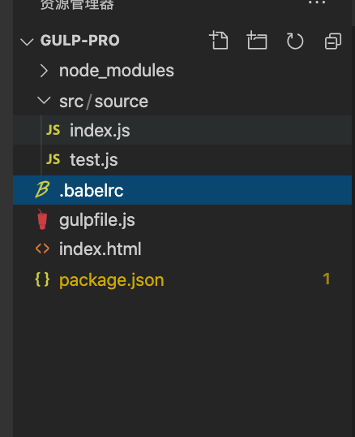
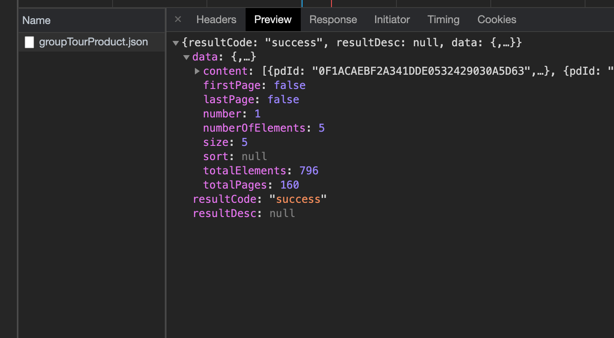
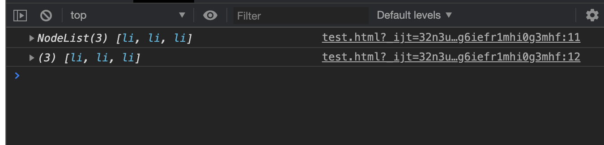

# 一、介绍 #

## 介绍 ##

1. ECMAScript和JavaScript
  - ECMAScript是标准（ECMA是一个专门为技术制定标准的组织），JavaScript是基于ECMAScript标准来实现的一种编程语言。 
  	- 类似于HTML5（是Web中核心语言HTML的规范）是标准，IE10、Chrome、FF都是实现
  - ECMAScript简称ECMA或ES

2. 什么是es6

   ECMA组织在2015年正式发布了ECMAscript6.0，简称ES6，又称为ECMAscript2015。
   
   https://es6.ruanyifeng.com/#docs/destructuring 

## 兼容性

- http://kangax.github.io/compat-table/es5/

- http://kangax.github.io/compat-table/es6/

- ES6(ES2015)——Edge、Chrome、FireFox、移动端、NodeJS

- 如果需要在低版本浏览器兼容怎么办？

  编译(利用gulp 和babel) 也可以借助其他的编译工具，比如 webpack

  - gulp和babel编译es6
>注意：
>
>1.电脑安装了node 获取npm下载包      npm -v
>
>2.全局安装了gulp 
>
>​	npm i gulp -g
>
>​	gulp -v
>
>https://www.gulpjs.com.cn/
>
>https://babeljs.io/docs/en/babel-preset-env    

  ```
//进入到自己的项目目录
  npm init
  
  npm i gulp gulp-babel  @babel/core @babel/preset-env --save-dev
  
  ```

  ```
     新建gulpfile.js
     //引入gulp，gulp-babel的npm模块；
     var gulp = require('gulp');
     var babel = require('gulp-babel');
     
     //创建gulp运行代码
     gulp.task('babel', function () { //‘babel’ gulp的脚本名称，自定义命名
         return gulp.src('./src/source/**/*.js') //js入口文件，可用绝对路径、相对路径，是文件类型
             .pipe(babel())          //运行gulp-babel进行编译
             .pipe(gulp.dest('./src/js/'))  //编译后的文件输出地址，是文件夹类型
    });
  
    gulp.task('watch', () => {
    return new Promise(function (resolve, reject) {
      gulp.watch('./src/source/**/*.js', gulp.series('babel'))//watch监听文件
      resolve();
      })
    })
  ```

  ```
  新建.babelrc文件
{
      "presets": [
          ["@babel/preset-env"]
      ]
  }
  ```

  
## 变量

- var
  - 可以重复声明
  - 无法限制修改
  - 没有块级作用域，是函数作用域

```
//在块级作用域内声明变量，在外部依然能够访问
if(true){
	var a=12;
}
alert(a);
```

```
<!DOCTYPE html>
<html lang="en">
<head>
	<meta charset="UTF-8">
	<title>Document</title>
</head>
<body>
	<input type="button" value="按钮1">
	<input type="button" value="按钮2">
	<input type="button" value="按钮3">
</body>
<script type="text/javascript">
	window.onload=function(){
        var aBtn=document.getElementsByTagName('input');
        for (var i = 0; i < aBtn.length; i++) {
            aBtn[i].onclick=function(){
                alert(i)
            };
        }
        console.log(i)
    };
</script>
</html>
```


- let
  - 不能重复声明
  - 变量-可以修改
  - 块级作用域

```
//不能重复声明
let a=12;
let a=5;
console.log(a); //报错

//块级作用域
if(true){
	let a=12;
}
alert(a); //报错
```

- const
  - 不能重复声明
  - 变量-不能修改
  - 块级作用域

```
//常量不能修改
const a=12;
a=5;
console.log(a); //报错 常量不能修改
```

>在Es6中，采用let或者const定义变量，有效的解决了命名冲突的问题。在大型项目中，重复声明这件事，指不定你定义了什么东西别人也定义了。还不报错，这个时候定位bug就变得比较困难了。

## 解构赋值

- 数组的解构

  ```
  //常规赋值
  let a = 1;
  let b = 2;
  let c = 3;
  
  //数组的解构赋值
  let [a,b,c]=[1,2,3];
  let [foo, [[bar], baz]] = [1, [[2], 3]];
  let [head, ...tail] = [1, 2, 3, 4];
  let [x, , y] = [1, 2, 3];
  let [a, [b], d] = [1, [2, 3], 4];
  
  //解构赋值允许指定默认值。
  let [foo = true] = []; //foo = true
  let [x, y = 'b'] = ['a', undefined]; // x='a', y='b'
  let [x, y = 'b'] = ['a', null];  //x='a' y = ?
  
  ```

  >ES6 内部使用严格相等运算符（`===`），判断一个位置是否有值。所以，只有当一个数组成员严格等于`undefined`，默认值才会生效。

- 对象的解构

  - 对象的解构与数组有一个重要的不同。数组的元素是按次序排列的，变量的取值由它的位置决定；而对象的属性没有次序，变量必须与属性同名，才能取到正确的值。

  ```
  let { foo, bar } = { foo: 'aaa', bar: 'bbb' };  //foo='aaa'  bar='bbb'
  
  let { baz } = { foo: 'aaa', bar: 'bbb' };  //baz = undefined
  
  //别名
  let { foo: baz } = { foo: 'aaa', bar: 'bbb' };  
  //baz = "aaa"  
  //foo  error: foo is not defined
  
  //嵌套结构
  let obj = {
    p: [
      'Hello',
      { y: 'World' }
    ]
  };
  
  let { p: [x, { y }] } = obj;
  x // "Hello"
  y // "World"
  
  //解构赋值允许指定默认值。
  let {x = 3} = {};  //x=3
  
  let {x, y = 5} = {x: 1};  //x=1  y=5
  
  let {x: y = 3} = {x: 5};   //?
  ```

- 函数参数解构赋值

  ```
  //eg1
  function move({x = 0, y = 0} = {}) {
    return [x, y];
  }
  
  move({x: 3, y: 8}); // [3, 8]
  move({x: 3}); // [3, 0]
  move({}); // [0, 0]
  move(); // [0, 0]
  
  
  //eg2
  function move({x, y} = { x: 0, y: 0 }) {
    return [x, y];
  }
  
  move({x: 3, y: 8}); // [3, 8]
  move({x: 3}); // [3, undefined]
  move({}); // [undefined, undefined]
  move(); // [0, 0]
  ```

- 解构赋值的用途之提取json数据

  >我们平常请求后台数据的时候，后台会返回一个大的json，这个时候，采用解构赋值，就方便很多了



```
//es6之前的写法
$.ajax({
  ...,
  success:function(res){
  	var resultCode = res.resultCode;
		var content = res.data.content;
		var totalPages = res.data.totalPages;
		console.log(resultCode,content,totalPages)
  }
})

//es6写法

$.ajax({
  ...,
  success:({resultCode,data:{content,totalPages}})=>{
  	console.log(resultCode,content,totalPages)
  }
})

$.ajax({
  ...,
  success:res=>{
  	let {resultCode,data:{content,totalPages}} = res;
  	console.log(resultCode,content,totalPages)
  }
})
```

## 字符串的扩展

- 模版字符串

  ```
  //常规写法
  let title='标题';
  let content='内容';
  let str='<div>'+
     '<h1>'+title+'</h1>'+
     '<p>'+content+'</p>'+
  '</div>';
  $('#list').html(str)
  
  //es6写法
  let str2=`<div>
    <h1>${title}</h1>
    <p>${content}</p>
  </div>`;
  $('#list').html(str2)
  
  ```

  

- 字符串新增的常用方法

  - includes()   //返回布尔值，表示是否找到了参数字符串。

    ```
    let s = 'Hello world!';
    s.includes('o') // true
    ```

    

  - startsWith()  // 返回布尔值，表示参数字符串是否在原字符串的头部。

    ```
    let str='https://m.17ecgo.com/index.html';
    if(str.startsWith('http://')){
    	alert('普通网址');
    }else if(str.startsWith('https://')){
    	alert('加密网址');
    }else{
    	alert('其他');
    }
    ```

    

    

  - endsWith()  //返回布尔值，表示参数字符串是否在原字符串的尾部

    ```
    let str='1.png';
    if(str.endsWith('.txt')){
    	alert('文本文件');
    }else if(str.endsWith('.jpg')){
    	alert('JPG图片');
    }else{
    	alert('其他');
    }
    ```

## 函数扩展

- 箭头函数（在写法上对es5做了一些修整，代码看起来更显得简洁）
  - 如果只有一个参数，圆括号"()"可以省略
  - 函数体如果只有一句return语句，花括号"{}"和return可以一并省略

```
let arr=[55, 43, 6, 99, 22, 14, 325];
//普通写法
arr.sort(function (n1, n2){
return n1-n2;
});

//箭头函数写法
arr.sort((n1, n2)=>{
return n1-n2;
});

arr.sort((n1, n2)=>n1-n2);
alert(arr);
```

- 箭头函数也对this的指向做了修整

  ```
  //普通函数
  var obj = {
  say: function () {
    console.log(this)
    var This = this;
    setTimeout(function() {
      console.log(this)
      console.log(This)
    });
  }
  }
  obj.say();
  ```

  ```
  //箭头函数
  var obj = {
    say: function () {
      console.log(this)
      setTimeout(()=> {
        console.log(this)
      });
    }
  }
  obj.say();
  ```

​    

- 函数参数的默认值

  ES6 之前，不能直接为函数的参数指定默认值，只能采用变通的方法。

  ```
  function log(x, y) {
    y = y || 'World';
    console.log(x, y);
  }
  
  log('Hello') // Hello World
  log('Hello', 'China') // Hello China
  log('Hello', '') // Hello World
  ```

  ES6写法

  ```
  function log(x, y = 'World') {
    console.log(x, y);
  }
  
  log('Hello') // Hello World
  log('Hello', 'China') // Hello China
  log('Hello', undefined) // Hello World
  ```

- rest 参数（形式为`...变量名`）

  ```
  function show(a, b, ...args){
        alert(a,b,args);
  }
  
  show(12, 15, 8, 9, 20, 21, 90);
  ```

  ```
  // arguments变量的写法
  function sortNumbers() {
  	return Array.prototype.slice.call(arguments).sort((a,b)=>b-a);
  }
  console.log(sortNumbers(5,4,2,3,7))
  
  // rest参数的写法
  const sortNumbers2 = (...numbers) => numbers.sort((a,b)=>b-a);
  console.log(sortNumbers2(5,4,2,3,7))
  ```

## 数组的扩展

### 1. 扩展运算符（...）与解构赋值结合起来，用于复制数组，或者生成新的数组

```
//复制数组
let a1 = [1, 2];
//es6之前的写法
let a2 = a1.concat();
a2.push(3)
console.log(a1,a2)
//es6写法
let a3 = [...a1];
a3.push(3)  
console.log(a1,a3)  

//生成新的数组(适用于浅拷贝)
let arr1=[1,2,3];
let arr2=[5,6,7];
let arr3=[...arr1, ...arr2];
alert(arr3);  //[1,2,3,5,6,7]

```

### 2. 将类数组转换为真正的数组

```
<ul>
  <li>1</li>
  <li>2</li>
  <li>3</li>
</ul>

let nodeList = document.querySelectorAll('li');
let nodeList2 = [...document.querySelectorAll('li')];
console.log(nodeList)
console.log(nodeList2)
```



### 3. Array.from(将类似数组的对象转换为真正的数组对象)


```
let nodeList = Array.from(document.querySelectorAll('li'));
console.log(nodeList)
```

### 4.数组实例的find和findIndex

- 数组实例的`find`方法，用于找出第一个符合条件的数组成员。它的参数是一个回调函数，所有数组成员依次执行该回调函数，直到找出第一个返回值为`true`的成员，然后返回该成员。如果没有符合条件的成员，则返回`undefined`。

```
console.log([1, 4, -5, 10].find(n => n < 0))
```

- 数组实例的`findIndex`方法的用法与`find`方法非常类似，返回第一个符合条件的数组成员的位置，如果所有成员都不符合条件，则返回`-1`。

```
[1, 5, 10, 15].findIndex(function(value, index, arr) {
  return value > 9;
}) // 2
```

### 5. 介绍几种数组很有用的处理数据的方法

- filter
- every
- some
- map
- reduce

```
let books = [
	{name:'python',price:56},
	{name:'java',price:100},
	{name:'c++',price:95},
	{name:'javascript',price:49}
];

books.filter(item=>item.price>50)

books.every(item=>item.price>50)

books.some(item=>item.price >= 100)

books.map(item=>item.price)
books.map(item=>{
return{
    ...item,
    price:item.price*2
	}
})

books.reduce((tem,item,index)=>{
	if(index == 1){
		return tem.price+item.price
	}else{
		return tem + item.price
	}
})

```

## 对象的扩展

### 1. 扩展运算符（...）合并对象

```
let data = {
	a: {name:1},
	e:50
}

let params = {
	a:1,
	b:2,
	c:3,
	d:4,
	...data
}
console.log(params)
```

### 2.对象的简洁语法

- 属性名和变量名相同，可以只写一个

```
const a = 1;
const b = 2
let params = {
	a:a,
	b:b
}
等同于
let params = {a,b}
```

- 方法名可以简写

```
const o = {
  method: function() {
    return "Hello!";
  }
};
等同于
const o = {
  method() {
    return "Hello!";
  }
};
```

### 3. 属性名表达式

```
let propKey = 'foo';
let obj = {
  [propKey]: true,
  ['a' + 'bc']: 123
};
```

### 4. Object.keys()，Object.values(), Object.entries(obj), Object.fromEntries

```
let obj = { foo: 'bar', baz: 42 };
Object.keys(obj)
Object.values(obj)
let obj2 = Object.entries(obj);
Object.fromEntries(obj2)
```

## Set 

- ES6 提供了新的数据结构 Set。它类似于数组，但是成员的值都是唯一的，没有重复的值。

```
let arr = [1,1,2,2,3,3,4,4]

let set = new Set([1, 1,2,3,3,4,4,5,5]);

console.log([...set])

console.log(Array.from(set))
```

>let arr = [{a:1},{a:1}] 
>
>let set = [...new Set(arr)];
>
>arr[0] == arr[1]

## class

```
  //es6之前的写法
	function User(name, pass){
      this.name=name;
      this.pass=pass;
    }

    User.prototype.showName=function (){
      alert(this.name);
    };
    User.prototype.showPass=function (){
      alert(this.pass);
    };

    //-------------

    function VipUser(name, pass, level){
      User.call(this, name, pass);

      this.level=level;
    }

    VipUser.prototype=new User();
    VipUser.prototype.constructor=VipUser;

    VipUser.prototype.showLevel=function (){
      alert(this.level);
    };

    var v1=new VipUser('blue', '123456', 3);

    v1.showName();
    v1.showPass();
    v1.showLevel();
    
    //es6的写法
    class User{
      constructor(name, pass){
        this.name=name;
        this.pass=pass;
      }

      showName(){
        alert(this.name);
      }
      showPass(){
        alert(this.pass);
      }
    }

    class VipUser extends User{
      constructor(name, pass, level){
        super(name, pass);

        this.level=level;
      }

      showLevel(){
        alert(this.level);
      }
    }

    var v1=new VipUser('blue', '123456', 3);

    v1.showName();
    v1.showPass();
    v1.showLevel();
```

## Promise

- Promise 是异步编程的一种解决方案，比传统的解决方案——回调函数和事件——更合理和更强大。

  ```
  	//es6之前的写法
  	function request(url,callback) {
        $.ajax({
          url: url,
          dataType: 'json',
          success(arr) {
            callback && callback(arr);
          },
          error(err) {
            
          }
        })
      }
      request('data/arr.txt',function(arr){
         console.log(arr)
      })
      request('data/json.txt',function(json){
        console.log(json)
      })
      
      //es6的写法
      function requestPromise(url) {
        return new Promise((resolve,reject)=>{
          $.ajax({
            url,
            dataType: 'json',
            success(res) {
              resolve(res)
              if(res.status=='200'){
              resolve(res)
              }else{
              reject(res.status)
              }
            },
            error(err) {
              reject(err)
            }
          })
        })
      }
  
      requestPromise('data/arr.txt').then(res=>{
        console.log(res)
      }).catch(err=>{
      	console.log(err)
      })
      
  //同时请求多个接口的写法
  Promise.all([requestPromise('data/arr.txt'),requestPromise('data/json.txt')]).then(([arr,json])=>{
        console.log('成功了')
        console.log(arr,json)
      }).catch(err=>{
        console.log('失败了',err)
      })
  ```

## async 和 await (es2017)


```
function requestPromise(url, data) {
      return new Promise((resolve, reject) => {
        $.ajax({
          url,
          data,
          dataType: 'json',
          success(res) {
            console.log(url)
            resolve(res)
          },
          error(err) {
            reject(err)
          }
        })
      })
    }

    async function readData() {
      let data1 = await requestPromise('data/arr.txt');
      let data2 = await requestPromise('data/json.txt', { name: data1[0] });
      let data3 = await requestPromise('data/num.txt', data2);
      console.log(data1, data2, data3);
    }

    // let readData = async ()=>{
    //   let data1=await requestPromise('data/arr.txt');
    //   let data2=await requestPromise('data/json.txt',{name:data1[0]});
    //   let data3=await requestPromise('data/num.txt',data2);
    //   console.log(data1, data2, data3);
    // }

    readData();
```

## Module

### 具名导出

```
//module.js
let str = 'gzl';
let fn = (str='hello')=>{
    console.log(str)
}
let json = {
    a:1,
    b:2
}

export { str, fn ,json }


//使用 index.js
//方式1
import { str, fn, json } from './module.js';
console.log(str,fn,json)
//方式2
import * as myJson from './module.js';
myJson.fn('易起行，一定行')
```

### 默认导出

```
//module.js (一个js只有一个默认导出export default)

//导出一个方法
export default function(){
    console.log('hello word')
}

//导出一个变量
export default 10;

//导出一个对象
export default {
    str,
    fn,
    json,
}

//index.js
import xx from '.module.js';
console.log(xx)

```


